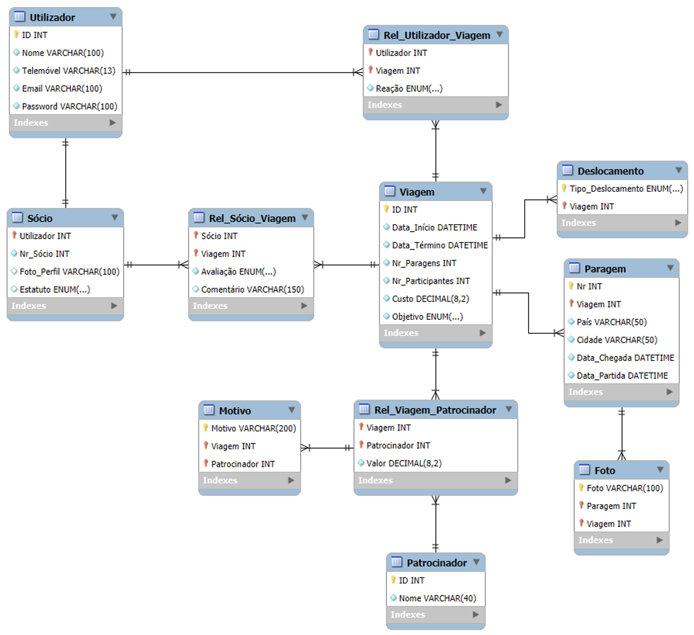

# BeLIUM Viagens

Este repositório foi concebido para o projeto ‘BeLIUM Viagens’, desenvolvido no âmbito da unidade curricular “Base de Dados”, lecionada no segundo ano da Licenciatura em Engenharia Informática.  Trata-se de um projeto académico com um contexto de natureza fictícia.

O desígnio primordial deste sistema reside na centralização, organização e preservação do registo histórico das viagens e iniciativas pedagógicas promovidas pelo CeSIUM (Centro de Estudantes de Engenharia Informática da Universidade do Minho), uma vez que se identificou que, não obstante o vasto património de atividades realizadas por diversas gerações, a informação encontrava-se dispersa por canais informais, comprometendo a memória institucional e o planeamento estratégico. 

Nesse sentido, a solução surge como uma resposta estruturada para mitigar a fragmentação de dados, visando facilitar a tomada de decisão sobre destinos e orçamentos, otimizar recursos e criar um portfólio público que perpetue a cultura da comunidade académica e alumni.

## Arquitetura e Desenvolvimento

Para materializar estes objetivos, a arquitetura do sistema foi meticulosamente desenhada em estrita conformidade com o ciclo de vida de desenvolvimento de uma base de dados, iniciando-se o processo com a modelação conceptual através da ferramenta _brModelo_ para a construção de Diagramas Entidade-Relacionamento (ER). Subsequentemente, na fase de modelação lógica efetuada no _MySQL Workbench_, a estrutura foi refinada através de processos rigorosos de normalização até à Terceira Forma Normal (3FN), garantindo a integridade referencial e a eliminação de redundâncias, ao passo que a validação teórica das interrogações foi assegurada via Álgebra Relacional com recurso à calculadora _RelaX_.

<table border="0">
 <tr>
    <td align="center" width="50%">
       
        
       <b>Figura 1:</b> Diagrama Entidade-Relacionamento (ER)
    </td>
    <td align="center" width="50%">
       
        
       <b>Figura 2:</b> Esquema Lógico Relacional (MySQL)
    </td>
 </tr>
</table>

## Gestão de Permissões

Paralelamente à modelação de dados, a arquitetura de segurança do sistema implementa um modelo rigoroso de controlo de acessos, estruturado numa hierarquia de privilégios de três níveis, desenhada para assegurar a integridade dos dados e a correta segregação de funções. 

| Perfil | Nível | Responsabilidades |
| :--- | :--- | :--- |
| **Administração** | Total | Autoridade máxima sobre a plataforma. Compete-lhes a supervisão técnica integral, gestão de credenciais, manutenção da base de dados e administração financeira (controlo de orçamentos e patrocínios). |
| **Sócio** | Operacional | Membros ativos do núcleo. Detêm privilégios de escrita para alimentação do sistema, sendo responsáveis pelo registo de viagens, definição de itinerários, carregamento de fotos e feedback qualitativo. |
| **Utilizador** | Consulta | Camada de acesso público. A interação restringe-se à visualização do catálogo de viagens e interação social básica (reações), garantindo a proteção da estrutura de dados contra modificações não autorizadas. |

## Estrutura de Ficheiros

Em termos de organização física, a arquitetura do repositório promove a modularidade e a escalabilidade, encontrando-se segmentada em dois diretórios principais, sendo estes os seguintes.

1. **`src`**: Funciona como o núcleo estrutural, centralizando a definição de tabelas e restrições.
  
2. **`adv`**: Integra a camada de lógica de negócio, abrangendo procedimentos armazenados, vistas, índices e o conjunto de interrogações necessárias para satisfazer os requisitos funcionais.
