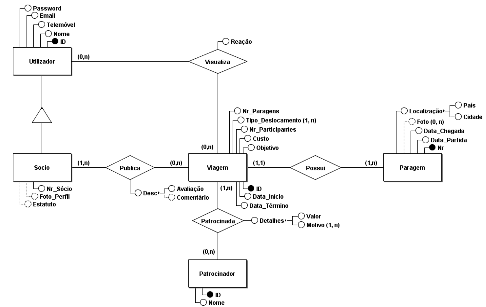
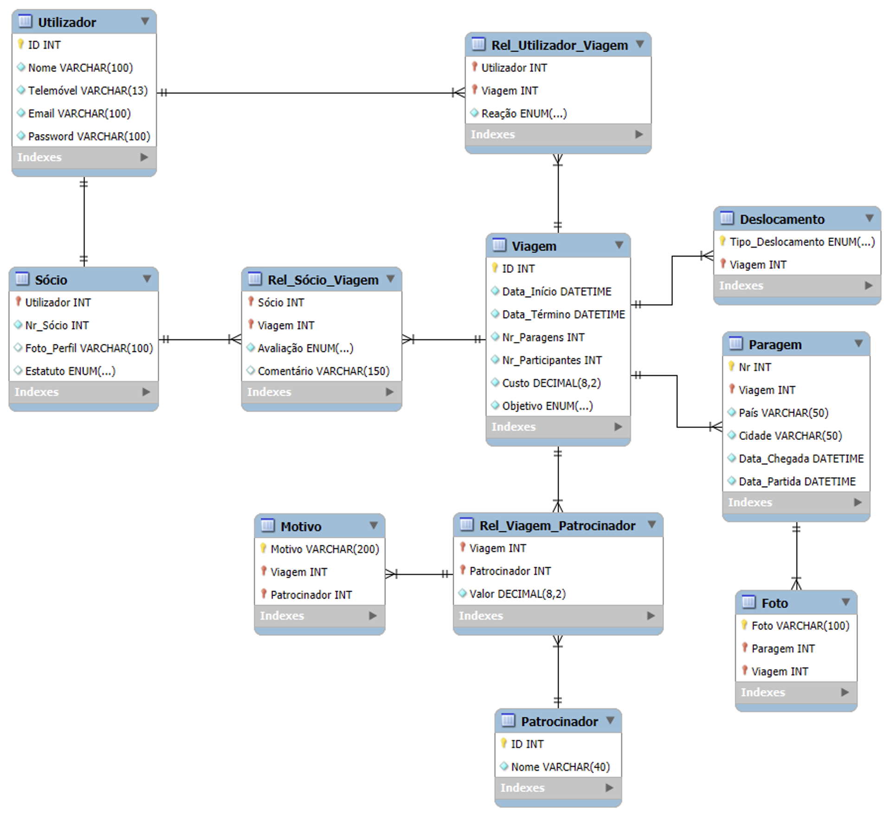

# BeLIUM Viagens

> 16/20

## Português

Este repositório destina-se ao projeto 'BeLIUM Viagens', desenvolvido no âmbito da unidade curricular “Base de Dados”. Esta plataforma foi concebida para a centralização, organização e preservação do registo histórico das viagens e iniciativas pedagógicas promovidas pelo CeSIUM (Centro de Estudantes de Engenharia Informática da Universidade do Minho), mitigando a fragmentação de dados e perpetuando a memória institucional do núcleo estudantil.

Para materializar estes objetivos, o desenvolvimento da base de dados seguiu um ciclo de vida rigoroso. Iniciou-se com a modelação conceptual (Diagrama Entidade-Relacionamento) recorrendo ao *brModelo*, avançando posteriormente para o modelo lógico no *MySQL Workbench*. A estrutura foi refinada através de processos de normalização até à Terceira Forma Normal (3FN) para eliminar redundâncias e garantir a integridade dos dados, tendo as interrogações sido validadas teoricamente via Álgebra Relacional com a calculadora *RelaX*.

A arquitetura de segurança do sistema implementa um controlo de acessos estruturado em três níveis de privilégios. O perfil de **Administração** detém autoridade máxima, sendo responsável pela supervisão técnica, gestão de credenciais e controlo financeiro de orçamentos e patrocínios. O perfil de **Sócio** opera ao nível de escrita, registando novas viagens, itinerários e feedback qualitativo. Por fim, o perfil de **Utilizador** restringe-se a consultas e interação social básica (reações), salvaguardando a integridade do sistema.

A organização física do repositório foi desenhada de forma modular e escalável, distribuindo a estrutura da base de dados em pastas específicas: a pasta `schema` centraliza a definição de tabelas e utilizadores, enquanto a pasta `logic` encapsula os procedimentos armazenados, triggers, vistas, índices e interrogações funcionais. A documentação do projeto, incluindo diagramas, apresentação e o relatório final, encontra-se organizada no diretório `docs`.

Made with ❤️ by Diogo Azevedo, Bruno Magalhães, Simão Santos & Vera Almeida

## English

This repository is intended for the 'BeLIUM Viagens' project, developed as part of the academic course “Databases”. This platform was designed to centralize, organize, and preserve the historical records of trips and educational initiatives promoted by CeSIUM (Software Engineering Student Branch at the University of Minho), mitigating data fragmentation and safeguarding the student association's institutional memory.

To achieve these objectives, the database development followed a rigorous lifecycle. It began with conceptual modeling (Entity-Relationship Diagram) using *brModelo*, followed by logical modeling in *MySQL Workbench*. The structure was refined through normalization processes up to the Third Normal Form (3FN) to eliminate redundancies and guarantee data integrity, with database queries theoretically validated via Relational Algebra using the *RelaX* calculator.

The system's security architecture implements an access control model structured across three privilege levels. The **Administration** profile holds maximum authority, overseeing technical supervision, credential management, and financial control over budgets and sponsorships. The **Sócio** (Member) profile operates at the write level, recording new trips, itineraries, and qualitative feedback. Finally, the **Utilizador** (User) profile is restricted to read-only queries and basic social interactions (reactions), protecting the database's integrity.

The repository's physical layout was designed for modularity and scalability, partitioning the database structure into dedicated folders: the `schema` folder centralizes table and user definitions, while the `logic` folder encapsulates stored procedures, triggers, views, indexes, and functional queries. Supporting project documentation, including diagrams, presentation, and the final report, is organized within the `docs` directory.

Made with ❤️ by Diogo Azevedo, Bruno Magalhães, Simão Santos & Vera Almeida

## Diagramas - Diagrams

### Diagrama Entidade-Relacionamento (ER) - Entity-Relationship Diagram (ER)
[PT] Desenvolvido com recurso a tecnologias como o *brModelo* para representar o modelo conceitual.\
[EN] Developed using technologies such as *brModelo* to represent the conceptual model.

### Esquema Lógico - Logical Schema
[PT] Desenvolvido com recurso a tecnologias como o *MySQL Workbench* para representar o modelo relacional.\
[EN] Developed using technologies such as *MySQL Workbench* to represent the relational model.

## Como Executar - How to Run

### Instanciação da Base de Dados - Database Instantiation

[PT] Pode instanciar e testar a base de dados utilizando o **MySQL Workbench** ou o cliente de terminal do MySQL. A execução deve seguir a ordem de dependências lógica para evitar erros de chave estrangeira ou integridade referencial:

[EN] You can instantiate and test the database using **MySQL Workbench** or the MySQL terminal client. The execution must follow the logical dependency order to prevent foreign key or referential integrity errors:

1. **Schema (Estrutura Básica - Basic Structure)**:
   * `schema/database.sql`
   * `schema/tables.sql`
   * `schema/users.sql`
2. **Logic (Lógica de Negócio - Business Logic)**:
   * `logic/views.sql`
   * `logic/functions.sql`
   * `logic/triggers.sql`
   * `logic/indexes.sql`
   * `logic/prepared-statements.sql`
   * `logic/other-procedures.sql`
3. **Population (Preenchimento de Dados - Data Seeding)**:
   * `logic/population/insersion-procedures.sql`
   * `logic/population/population.sql`
